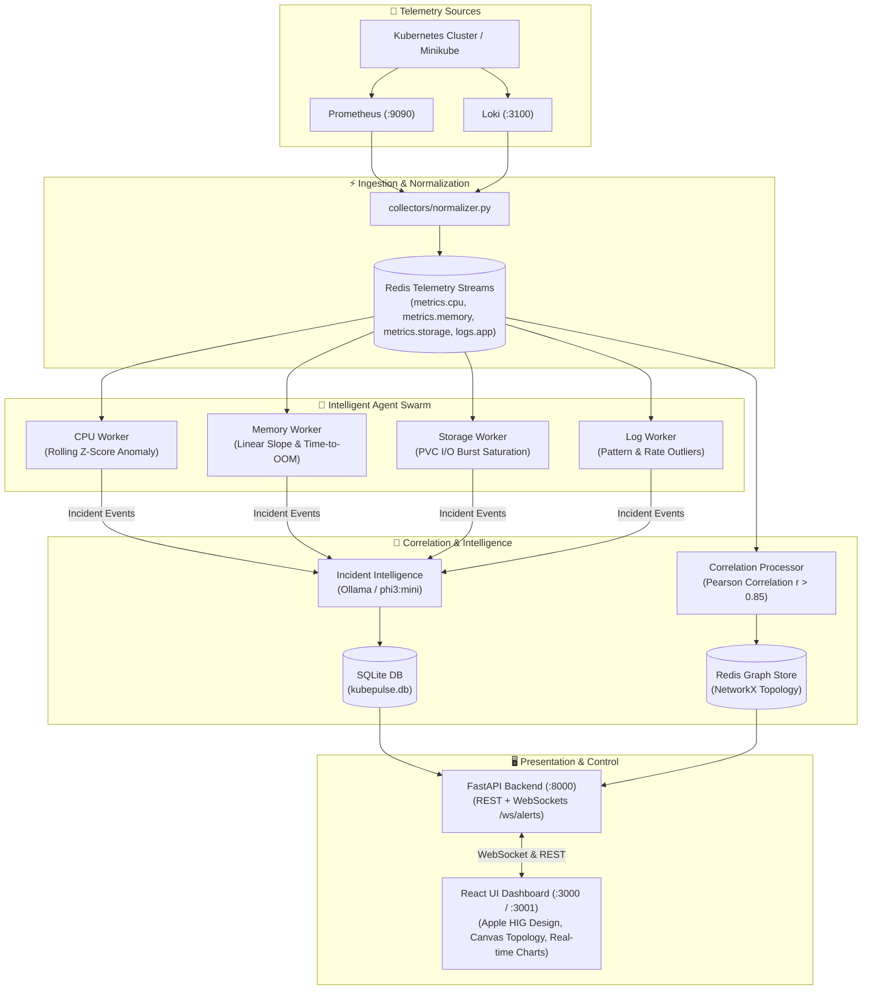

# 🩺 KubePulse AI

> **Autonomous Kubernetes Telemetry Observability, Multi-Signal Anomaly Detection, Topology Correlation & AI Incident Intelligence**

[](https://python.org)
[](https://fastapi.tiangolo.com)
[](https://redis.io)
[](https://reactjs.org)
[](https://www.typescriptlang.org)
[](https://kubernetes.io)
[](LICENSE)

---

## 📖 Overview

**KubePulse AI** is an end-to-end, real-time Kubernetes observability and autonomous incident response platform. It streams high-velocity telemetry (metrics and logs) from Prometheus and Loki, normalizes data through Redis Streams, and utilizes a swarm of specialized statistical agents to detect anomalies, forecast resource exhaustion, calculate cross-pod Pearson correlation graphs, and synthesize natural language root-cause analysis with local LLMs (Ollama).

Results are visualized through a real-time **Apple Human Interface Guidelines (HIG)**-inspired dashboard featuring interactive topology graphs, live incident timelines, and bidirectional WebSocket alerts.

---

## 🏗️ Architecture



---

## ✨ Key Features

- **⚡ Multi-Signal Agent Swarm**:
  - **CPU Worker**: Baseline rolling window calculation with statistical Z-score anomaly detection ($Z > 3.0$).
  - **Memory Worker**: Linear regression slope estimation ($dM/dt$) and proactive predictive **Time-to-OOM** forecasting.
  - **Storage Worker**: Persistent Volume Claim (PVC) I/O throughput burst and saturation monitoring.
  - **Log Worker**: High-frequency error spike and pattern clustering.
- **🔗 Cross-Pod Dynamic Correlation Graph**: Computes real-time Pearson correlation matrices ($r > 0.85$) across metrics to map cascading failures and dependency graphs.
- **🧠 Local LLM Incident Intelligence**: Integrates with on-prem Ollama (`phi3:mini` or custom models) to deliver human-readable root-cause explanations and concrete mitigation steps without data egress.
- **🎨 Glassmorphic Apple HIG Dashboard**: Modern dashboard with dark theme, smooth micro-interactions, canvas-driven topology graph, live metric telemetry, and instant WebSocket notifications.
- **💥 Built-in Chaos Simulation Suite**: Inject multi-vector chaos streams (CPU surges, memory leaks, I/O saturation, cascade outages) for testing and demos.
- **🚀 One-Click Orchestration**: Automated background bootstrap and teardown scripts (`start_all.sh`, `stop_all.sh`).

---

## 📁 Project Structure

```text
kubepulse.ai/
├── agents/                       # Autonomous anomaly detection workers
│   ├── base_worker.py            # Base Redis Stream consumer worker
│   ├── cpu_worker.py             # Z-Score CPU anomaly detector
│   ├── memory_worker.py          # Predictive OOM & regression worker
│   ├── storage_worker.py         # Disk & PVC I/O burst analyzer
│   └── log_worker.py             # Log error frequency worker
├── api/                          # FastAPI REST & WebSocket server
│   └── main.py                   # API routes (/api/incidents, /api/graph, /ws/alerts)
├── cluster/                      # Kubernetes definitions & manifest configs
│   └── microservices.yaml        # Sample microservice topology
├── collectors/                   # Telemetry scrapers & normalizers
│   └── normalizer.py             # Prometheus/Loki scraper -> Redis Stream publisher
├── correlation/                  # Topology graph & correlation engines
│   ├── correlation_processor.py  # Pearson correlation analyzer
│   ├── db_writer.py              # Persistent SQLite writer
│   └── graph_store.py            # NetworkX graph manager in Redis
├── dashboard/                    # React frontend application
│   ├── src/                      # Components, App.tsx, Apple HIG styles
│   └── package.json              # Dashboard dependencies
├── demo/                         # Chaos testing and simulation engines
│   ├── artificial_chaos_simulator.py # Multi-vector chaos stream injector
│   └── simulate_criticals.py     # Critical incident simulation
├── nlp/                          # LLM incident enrichment
│   └── incident_intelligence.py  # Ollama LLM root cause synthesizer
├── tests/                        # Automated unit & integration test suites
│   ├── test_api.py               # REST endpoint validation
│   └── test_pipeline.py          # Mathematical & pipeline regression tests
├── config.py                     # Centralized environment configuration
├── pyproject.toml                # Pytest & project build configuration
├── requirements.txt              # Python runtime dependencies
├── start_all.sh                  # One-click startup script (Minikube + Pipeline + API)
├── stop_all.sh                   # Clean shutdown script
└── README.md                     # Project documentation
```

---

## ⚙️ Configuration & Environment Variables

All configuration is centralized in [`config.py`](config.py) and can be customized via `.env` or environment variables:

| Variable | Default Value | Description |
| :--- | :--- | :--- |
| `REDIS_HOST` | `localhost` | Redis server hostname |
| `REDIS_PORT` | `6379` | Redis server port |
| `REDIS_PASSWORD` | `None` | Optional Redis authentication password |
| `PROMETHEUS_URL` | `http://localhost:9090` | Prometheus HTTP endpoint |
| `LOKI_URL` | `http://localhost:3100` | Grafana Loki HTTP endpoint |
| `OLLAMA_URL` | `http://localhost:11434/api/generate` | Ollama LLM generation endpoint |
| `OLLAMA_MODEL` | `phi3:mini` | Target Ollama model name |
| `DB_PATH` | `kubepulse.db` | SQLite database file path |
| `DEFAULT_MEM_LIMIT`| `536870912` *(512MB)* | Fallback pod memory limit in bytes |
| `API_HOST` | `0.0.0.0` | FastAPI binding host |
| `API_PORT` | `8000` | FastAPI server port |

---

## 🚀 Quick Start Guide

### Prerequisites

- **Linux, macOS, or WSL2**
- **Python 3.11+**
- **Node.js 18+** & **npm**
- **Docker** and/or **Minikube**

---

### Method 1: Automated Startup (Recommended)

To start Minikube, port-forwards, Redis, all AI workers, and the FastAPI server in one command:

```bash
# 1. Clone repository
git clone git@github.com:nagadurgarao-01/KubePulse.ai.git
cd KubePulse.ai

# 2. Set up Python virtual environment
python3 -m venv .venv
source .venv/bin/activate
pip install -r requirements.txt

# 3. Start everything
chmod +x start_all.sh stop_all.sh
./start_all.sh
```

To stop all running background services:
```bash
./stop_all.sh
```

---

### Method 2: Manual Step-by-Step Setup

#### 1. Start Redis
```bash
docker run -d --name redis -p 6379:6379 redis:7-alpine
```

#### 2. Start Pipeline Workers
In your activated virtual environment:
```bash
python collectors/normalizer.py &
python -m agents.cpu_worker &
python -m agents.memory_worker &
python -m agents.storage_worker &
python -m agents.log_worker &
python -m correlation.correlation_processor &
python -m correlation.db_writer &
python -m nlp.incident_intelligence &
```

#### 3. Start API Server
```bash
uvicorn api.main:app --host 0.0.0.0 --port 8000 --reload
```

#### 4. Launch React Dashboard
```bash
cd dashboard
npm install
npm start
```

Open [http://localhost:3000](http://localhost:3000) (or `http://localhost:3001`) in your browser.

---

## 💥 Chaos Simulation & Demos

KubePulse AI includes a multi-vector artificial chaos simulator to test alerting, correlation graphs, and LLM summaries without needing a live broken cluster:

```bash
# Run cascading chaos simulation across multiple microservices
python demo/artificial_chaos_simulator.py
```

This simulates:
1. **CPU Surge** on batch workers ($Z > 4.0$).
2. **Rapid Memory Leaks** on payment services ($dM/dt > 15 \text{ MB/s}$, Time-to-OOM $< 10\text{ min}$).
3. **PVC Storage I/O Saturation** on order databases.
4. **Cascading Service Outages & Deadlocks** with live graph edge updates.

---

## 🧪 Running Tests

KubePulse AI uses `pytest` for pipeline and API verification:

```bash
# Run all automated unit and integration tests
pytest -v
```

Tests validate:
- REST API endpoints (`/api/health`, `/api/incidents`, `/api/graph`).
- CPU Z-Score anomaly math and threshold triggers.
- Memory linear regression slope and time-to-OOM predictive formulas.
- Pearson correlation matrix pair discovery.

---

## 📡 REST & WebSocket API Reference

| Endpoint | Method | Description |
| :--- | :--- | :--- |
| `/api/health` | `GET` | System health check and Redis connection status |
| `/api/incidents` | `GET` | List recent incidents with severity, reason, and LLM recommendations |
| `/api/graph` | `GET` | Active cluster topology nodes and correlated dependency edges |
| `/api/services` | `GET` | Microservices status and health summary |
| `/api/metrics` | `GET` | Recent telemetry metric streams |
| `/ws/alerts` | `WebSocket` | Real-time broadcast channel for instant incident notifications |

---

## 📜 License

This project is licensed under the [MIT License](LICENSE).